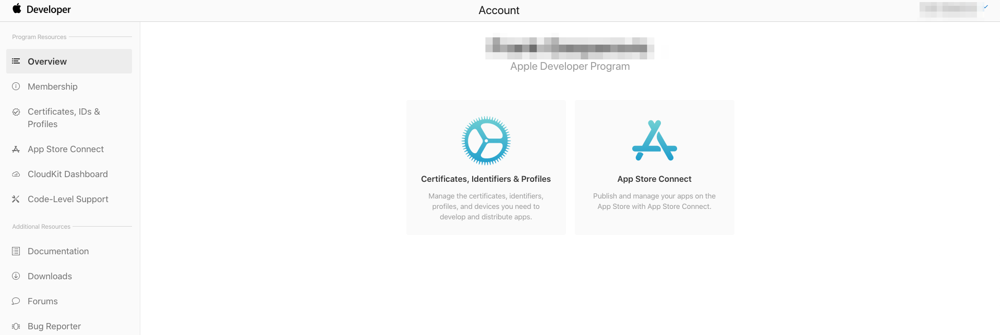
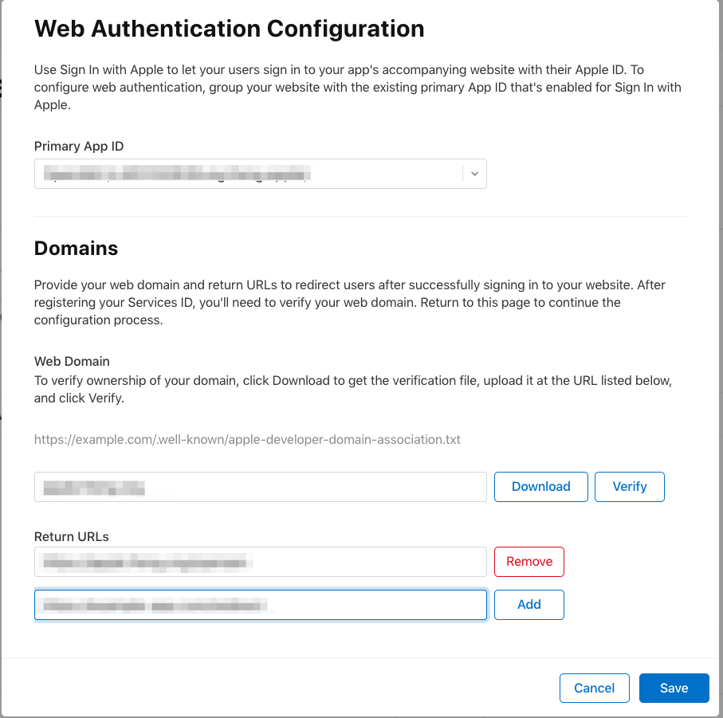
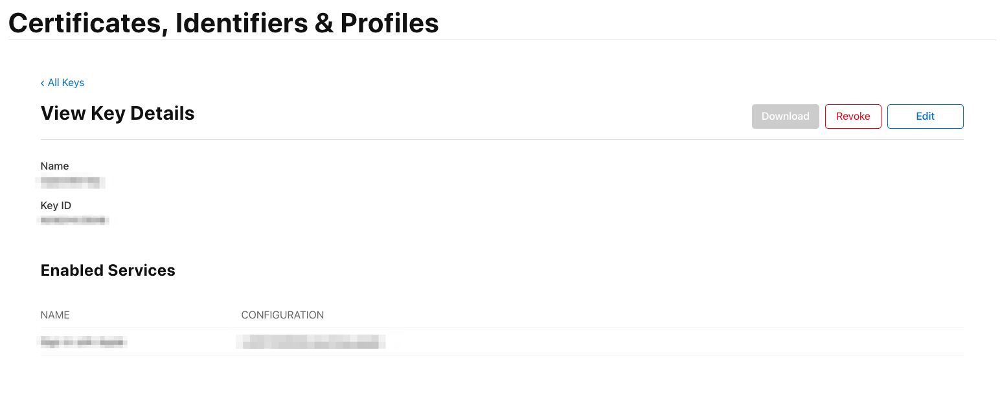
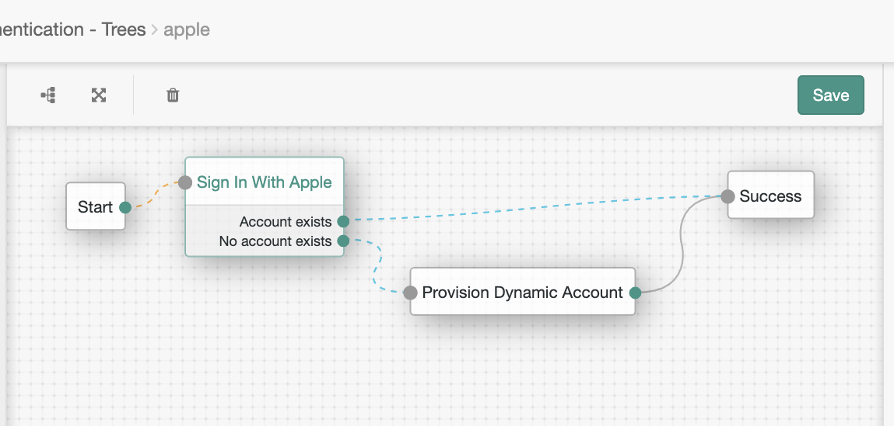
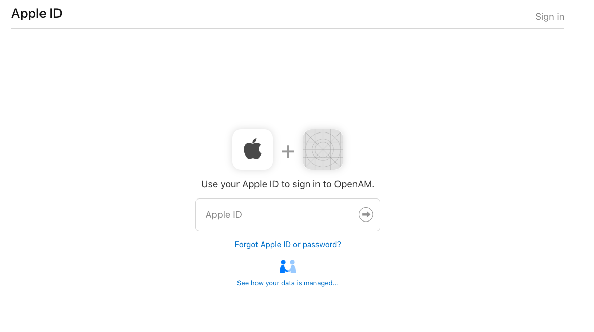

<!--
 * The contents of this file are subject to the terms of the Common Development and
 * Distribution License (the License). You may not use this file except in compliance with the
 * License.
 *
 * You can obtain a copy of the License at legal/CDDLv1.0.txt. See the License for the
 * specific language governing permission and limitations under the License.
 *
 * When distributing Covered Software, include this CDDL Header Notice in each file and include
 * the License file at legal/CDDLv1.0.txt. If applicable, add the following below the CDDL
 * Header, with the fields enclosed by brackets [] replaced by your own identifying
 * information: "Portions copyright [year] [name of copyright owner]".
 *
 * Copyright 2019 ForgeRock AS.
-->
# Sign In With Apple

An authentication node for Apple's Sign in with Apple service. For Access Management 6.5.1 and above. This is a tech 
preview and will continue to be updated as the Apple service changes.

**Build**

The code in this repository has binary dependencies that live in the ForgeRock maven repository. Maven can be 
configured to authenticate to this repository by following the following [ForgeRock Knowledge Base Article](https://backstage.forgerock.com/knowledge/kb/article/a74096897).

To build, run `mvn clean package`.

**Install**

Copy the .jar file from the ../target directory into the ../web-container/webapps/openam/WEB-INF/lib directory where 
AM is deployed.  Restart the web container to pick up the new node.  The node will then appear in the authentication 
trees components palette.

**Configure**

To configure a client to use with Access Management, you must have an account at https://developer.apple.com/. 

Sign in and click on "Certificates, Identifiers & Profiles".

Next, create a new App ID Identifier and enable "Sign in with Apple"

After that, create a new Service Identifier. This service Identifier will be the client secret used in the 
Authentication Node. Note, the Return URLs configured must be running TLS and be configured on port 443.

The next step is to create a key to be used to generate your client secret. Enable this key for use with Sign in with
Apple. Download this key and name it `key.txt`
 

Finally, create your client secret next by executing the following [script](https://github.com/aaronpk/sign-in-with-apple-example/blob/master/client-secret.rb).

Download the script to the same folder where you save your apple key. Next, update the kid value with your key id 
that you just created, the issuer with your Apple Team ID and the sub with your Apple Service ID. To execute the 
script, first make sure you have ruby installed. Then install the JWT library by running `gem install jwt`.  Execute 
the script by running `ruby client_secret.rb`. This will output a JWT that you will be used as your client secret for
the node.

Configure a new Authentication Tree in Access Management with the Sign in with Apple node and the Provision Dynamic 
Account Node like below. Set the Client Id to the Apple Service ID and the Client Secret to the JWT you just 
provisioned in the previous step. All other configuration have been set with the correct values to authorize end 
users to the Apple Sign In service.

**Try It Out**

Test out your new flow by navigating to https://{{hostname}}/openam/XUI/#login&service={{tree_name}} and find you are
redirected.
 

